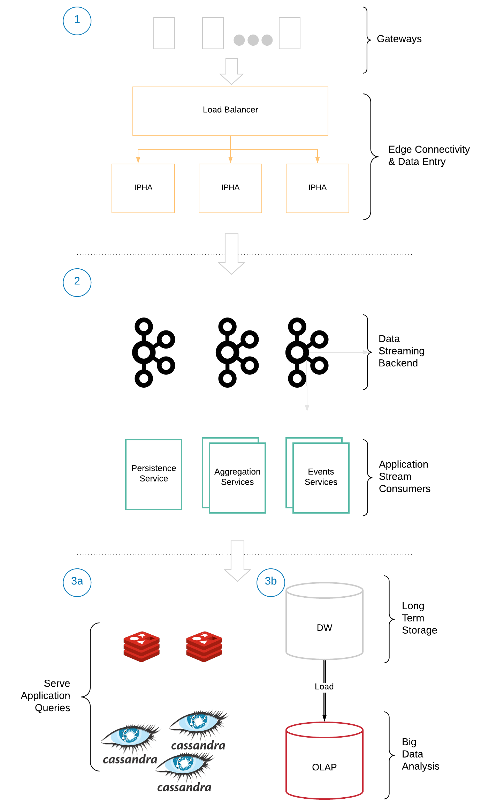

# Description

## Abstract

**Design and implementation of a big data architecture for storage, real-time processing and batch analysis of smart
metering data**

---

As the world continues to shift towards a more sustainable future, the need for efficient management of natural resources 
is becoming increasingly critical. This has led to the emergence of smart meters as a key technology in the utilities 
sector. Smart meters are intelligent devices that can collect and analyze electricity, water and gas consumption data 
in real-time, allowing for better monitoring and management of resource usage. With this data, utilities can make 
informed decisions about how to optimize their distribution networks and reduce wastage, while also providing customers 
with greater insight into their usage patterns and helping them to make more informed choices about their consumption.

In order to meet these needs, utilities must employ a combination of scalable and fault-tolerant storage systems, to 
store large amounts of data in an efficient and cost-effective manner. Additionally, stream processing technologies can 
be used to ingest and process real-time data as it is generated by the smart meters, enabling utilities and customers to
quickly detect and respond to anomalies, ultimately improving the efficiency and reliability of the service.

This dissertation focuses on the design and implementation of a scalable and extensible Lambda architecture for storing 
and analyzing the huge volume of data generated by smart meter devices, although it can generally be applied to any 
system that stores and processes time series data. In the proposed architecture, Apache Kafka is used as the messaging 
backbone, through which device metrics are made available to consumer applications. For real time processing, Kafka 
Streams and ksqlDB are used to calculate aggregates, filter and re-route messages, as well as alarm when outliers are 
detected. Cassandra is selected as the database for storing data for the medium-term, while S3 as the data lake for the 
long-term. The implementation focuses on the main data ingestion, stream processing and medium-term storage, with 
example flows being presented. Finally, performance tests are conducted to collect metrics to assess the scalability of 
key components of the architecture.

# Architecture




# Modules

- `common`: Classes re-used from all other modules, like converters, serdes and DTOs
- `consumer`: Implements various consuming applications, like:
  - Kafka consumer that prints metrics received to the console
  - Kafka Streams consumer that aggregates metrics in a time window and publishes the results back to Kafka
  - Kafka consumer that writes aggregated metrics into a cassandra database
  - Kafka consumer that tracks the time until a total message count has been received, used for performance testing of
  the aggregator
- `persistence`: Implements DAO for interfacing with Cassandra for persisting metric aggregates
- `replay`: Publisher application to replay data from specific datasets into Kafka


# Prerequisites

**Publisher**

For the publisher to be able to replay the data, place:
- At `replay/src/main/resources/dataset/ampds2/NaturalGas_WHG.csv` the csv version of the file `NaturalGas_WHG.tab` from
[AMPds2: The Almanac of Minutely Power dataset (Version 2)](https://dataverse.harvard.edu/dataset.xhtml?persistentId=doi:10.7910/DVN/FIE0S4)
- At `replay/src/main/resources/dataset/ampds2/Water_WHW.csv` the csv version of the file `Water_WHW.tab` from
  [AMPds2: The Almanac of Minutely Power dataset (Version 2)](https://dataverse.harvard.edu/dataset.xhtml?persistentId=doi:10.7910/DVN/FIE0S4)
- At `replay/src/main/resources/dataset/edf/household_power_consumption.txt` the txt file taken from the zip of
  [Individual household electric power consumption Data Set](https://archive.ics.uci.edu/ml/datasets/Individual+household+electric+power+consumption)


**Redis Kafka Connector**

Before starting `docker compose` place under `connect/redis-connector` the [Redis Sink Connector](https://www.confluent.io/hub/jcustenborder/kafka-connect-redis) after downloading as zip.


**Cassandra**

After starting `docker compose`, make sure to run `scripts/create-tables.cql` to have the base table
topology setup before running the cassandra sink(s).

# Build

Image of publisher application:
```agsl
./gradlew  :replay:jibDockerBuild
```

(Common) Image of consumer applications:

```agsl
./gradlew  :consumer:jibDockerBuild
```

# Run

Follow the commands and comments of `scripts/demo.sh`

To run a sample flow for kqlDB, follow the commands and comments of `ksqldb/queries.ksql`

